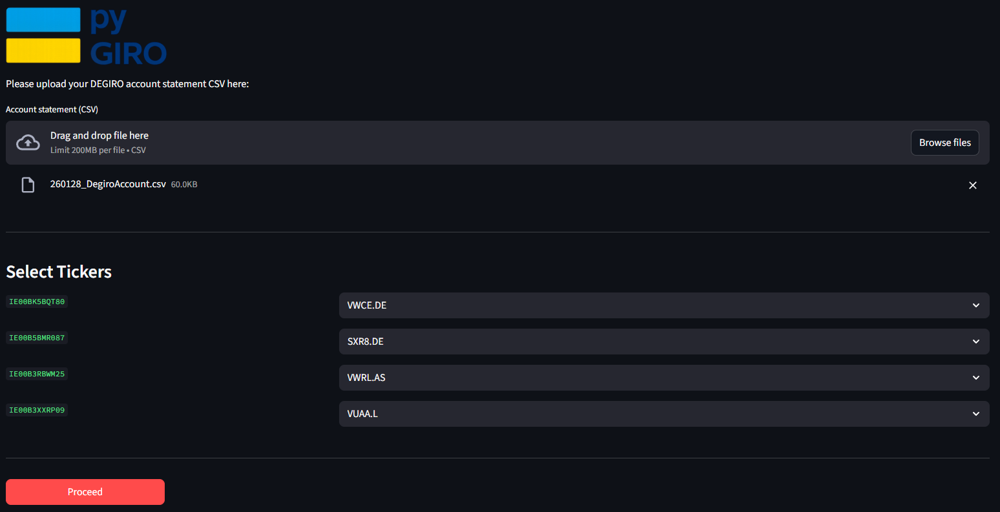
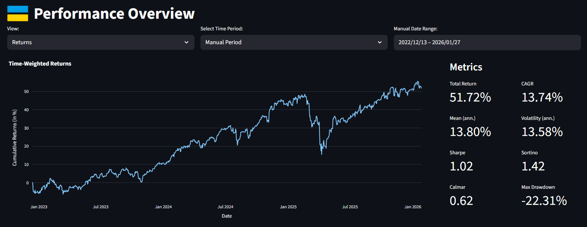

<p align="center">
  
</p>

<h3 align="center">
A Python toolkit for your DEGIRO brokerage account.
</h3>

---

## 🧠 About

**pyGIRO** serves as an analytical toolkit for your brokerage account and comes with a pre-built interactive 
performance dashboard. While **DEGIRO** is a cost-efficient broker, the analytical capabilities of their platform are
limited: retrievable data is unstructured and there are no charts or even time-weighted returns available, making it difficult to analyze your historic performance.

This library fills the gap by providing:

- **`pygiro`**: research-ready backend that prepares and enriches account data for custom portfolio analysis.
- **`dashboard`**: optional interactive UI for drag-and-drop performance insights without coding.


## ⚙️ Installation

### 1. Clone the repository

Clone the repository and navigate to the project root:

```bash
  git clone https://github.com/<your-username>/pygiro.git
  cd pygiro
```

### 2. Install dependencies
- **Option 1** - Install project and all dependencies via `pyproject.toml` *(recommended)*:

    ```bash
    pip install .
    ```

- **Option 2** - Direct installation of dependencies via `requirements.txt`:

    ```bash
    pip install -r requirements.txt
    ```

### Requirements

| Component   | Version / Notes                               |
|-------------|-----------------------------------------------|
| `Python`    | ≥ 3.10                                        |
| `pandas`    | Data handling and portfolio reconstruction    |
| `numpy`     | Numerical computations                        |
| `requests`  | External API calls (FX rates, mappings, etc.) |
| `yfinance`  | Market data retrieval                         |
| `streamlit` | Interactive dashboard                         |
| `plotly`    | Interactive visualizations                    |

All dependencies are specified in `pyproject.toml` and mirrored in `requirements.txt`.

## 🚀 Usage

### 📦 pygiro

---


The `pygiro` module is intended as a starting point for custom portfolio analysis. It takes care of the initial heavy 
lifting that is required when working with DEGIRO account data, such that you can focus on analysis rather than data
retrieval, cleaning and bookkeeping.

In particular, it can:

- **format** and clean raw DEGIRO **account statements**.
- reconstruct a **daily end-of-day portfolio**.
- retrieve **historical asset prices** and **FX rates**.
- convert all valuations consistently to a single currency.
- compute **Time-Weighted Returns (TWR)**.

The central abstraction is the `Account` class:

```python
from pygiro.degiro.account import Account

# Initialize brokerage account:
acc = Account(file="AccountStatement.csv",         # (required) file path or raw DataFrame
              mapping={'VWCE.DE':'IE00BK5BQT80'})  # (optional) mapping yahoo ticker to ISIN

# Compute time-weighted returns (optional):
acc.compute_returns()
```

During initialization, the `Account` performs the following steps:

- **Ticker Mapping**   
  Resolves ISINs to tickers with an automatic lookup for missing entries in the user-specified `mapping`.
- **Account statement formatting**  
  Cleans and standardizes the raw DEGIRO account statement and stores the result in the `statement` attribute.
- **Price and FX retrieval**  
  Retrieves historical prices and foreign exchange rates and applies FX conversion to a common currency (EUR).
- **Portfolio construction**  
  Constructs a daily end-of-day portfolio view and stores it in the `portfolio` attribute.

> **Note**  
> A single ISIN may correspond to multiple exchange listings. While automatic resolution accounts for currency and 
> is often sufficient, explicitly specifying the mapping is recommended to ensure accuracy.


The cleaned and standardized DEGIRO account `statement`, indexed by transaction time:

```python
>>> acc.statement.head()
```

```terminaloutput
                                        name          ISIN             description   ...  currency      type  shares
              index
2022-12-13 09:32:00                      NaN           NaN           iDEAL deposit   ...       EUR   deposit     NaN
2022-12-13 16:42:00         Vanguard S&P 500  IE00B3XXRP09     Koop 4 @ 71,999 EUR   ...       EUR       buy     4.0
2022-12-29 08:30:00         Vanguard S&P 500  IE00B3XXRP09                Dividend   ...       USD  dividend     NaN
2023-01-02 10:11:00  iShares Core MSCI World  IE00B4L5Y983      Koop 1 @ 68,06 EUR   ...       EUR       buy     1.0
2023-01-08 09:00:00         Vanguard S&P 500  IE00B3XXRP09  Verkoop 2 @ 75,120 EUR   ...       EUR      sell    -2.0
```

The table provides a clean transactional view with parsed numeric fields, classified transaction types and extracted
quantities such as shares and prices. 

However, most users will be more interested in the reconstructed end-of-day `portfolio`, indexed by (date, asset):

```python
>>> acc.portfolio
```

```terminaloutput
                          holding   investment           close       value
      date         asset
2022-12-13           EUR    12.01        12.01          1.0000     12.0100
            IE00B3XXRP09     4.00       288.00         69.4323    277.7291
       ...           ...      ...          ...             ...         ...
2026-01-30           EUR     5.12         5.12          1.0000      5.1200
            IE00B5BMR087    41.00     20949.66        620.4800  25439.6792
            IE00BK5BQT80   155.00     18456.06        146.1400  22651.6999
```

This portfolio provides a clean, analysis-ready view of your holdings, invested capital, FX-adjusted prices and 
valuations expressed consistently in EUR. Based on this the class is able to construct daily time-weighted `returns`:

```python
>>> acc.returns
```

```terminaloutput
                  TWR
      date      
2022-12-13   0.000000    
2022-12-14   0.000664 
2022-12-15  -0.008007          
       ...        ...    
2026-01-28  -0.004435       
2026-01-29  -0.002029         
2026-01-30   0.002278       
```

The return series is cash-flow neutral and suitable for performance analysis. Be aware that it includes non-trading days
in order to match the date index of `portfolio`.

### 🖥️ dashboard

---

The `dashboard` module provides an interactive, no-code interface built on top of the `pygiro` core library.
It is intended for users who want to explore portfolio performance visually without writing any code.

The dashboard allows you to:
- upload a DEGIRO account statement via drag-and-drop.
- interactively map ISINs to appropriate Yahoo tickers.
- explore portfolio performance, return metrics and P&L.
- switch between predefined periods (e.g. YTD) or custom date ranges.

All analytics and calculations are handled by the underlying backend, you only have to go to the project root and run:

```python
>>> streamlit run dashboard/app.py
```
**Ticker selection**



**Performance overview**




> **Note**  
> The dashboard is currently in an initial version. It will be extended over time with additional metrics,
> visualizations, and analysis. In the future, the dashboard is intended to be distributed as a standalone executable,
> removing the need to run it via Streamlit.


## ⚠️ Disclaimer

The **pyGIRO** library is an independent, open-source project and is **not affiliated with DEGIRO**.
It is provided to enhance user experience for educational and personal use only and does not constitute financial advice.
